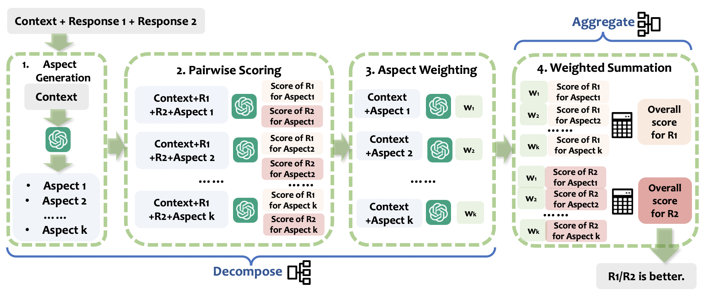

# Decompose-and-Aggregate
This repository contains the code implementation for the paper titled ["Decompose and Aggregate: A Step-by-Step Interpretable Evaluation Framework"](https://arxiv.org/abs/2405.15329).


## Abstract
The acceleration of Large Language Models (LLMs) research has opened up new possibilities for evaluating generated texts. They serve as scalable and economical evaluators, but the question of how reliable these evaluators are has emerged as a crucial research question. Prior research efforts in the meta-evaluation of LLMs as judges limit the prompting of an LLM to a single use to obtain a final evaluation decision. They then compute the agreement between LLMs' outputs and human labels. This lacks interpretability in understanding the evaluation capability of LLMs. In light of this challenge, we propose Decompose and Aggregate, which breaks down the evaluation process into different stages based on pedagogical practices. Our experiments illustrate that it not only provides a more interpretable window for how well LLMs evaluate, but also leads to improvements up to 39.6% for different LLMs on a variety of meta-evaluation benchmarks.

## Usage
This section explains how you can apply Decompose and Aggregate framework for using LLM-as-a-judge in an effective and interpretable way.

1. Inference:\
-Execute **`inference_gpt.py`**, **`inference_llama.py`**, and **`inference_mistral.py`** depending on the model to be used\

2. Prompt:\
-Direct prompting: use template **`Score.txt`**\
-CoT prompting: use template **`CoT.txt`**\
-Aspect generation: use template **`MetricsGen.txt`**\
-Aspect-wise scoring: use template **`EvalbyMetric.txt`**\
-Weighting generation: use template **`WGen.txt`**\

3. Weighting Evaluation

## Citation and Contact
If you find this repository helpful, please cite our paper.
```
@misc{li2024decompose,
      title={Decompose and Aggregate: A Step-by-Step Interpretable Evaluation Framework}, 
      author={Minzhi Li and Zhengyuan Liu and Shumin Deng and Shafiq Joty and Nancy F. Chen and Min-Yen Kan},
      year={2024},
      eprint={2405.15329},
      archivePrefix={arXiv},
      primaryClass={cs.CL}
}
```

Feel free to contact Minzhi at li.minzhi@u.nus.edu, if you have any questions about the paper.
